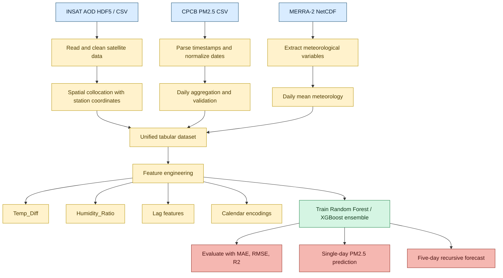

# AeroSphinx: Multi-Source Machine Learning for PM2.5 Estimation and Five-Day Air Quality Forecasting in Faridabad, India

## Abstract
Air pollution forecasting has become a practical scientific problem in urban India because fine particulate matter (PM2.5) affects public health, transportation planning, and regulatory decision-making. AeroSphinx is a data-driven air-quality modeling project that integrates satellite aerosol optical depth (AOD), ground-level PM2.5 observations from the Central Pollution Control Board (CPCB), and meteorological reanalysis variables from NASA MERRA-2 to estimate and forecast PM2.5 over Faridabad, India. The repository demonstrates a complete pipeline that begins with HDF5 and CSV ingestion, performs spatial collocation between satellite pixels and station coordinates, standardizes time stamps, engineers physically meaningful features, and trains tree-based regression models for prediction. The project also contains a more advanced forecasting scaffold with temporal lag features, cyclic calendar encodings, and ensemble learning logic, which makes it suitable for a five-day time-series extension.

This chapter-style study presents AeroSphinx as a reproducible framework for multi-source environmental intelligence. It explains the data pipeline, feature engineering choices, model design, and evaluation protocol, and it also expands the repository into a chapter-ready five-day rolling forecasting design. The study emphasizes why satellite-ground-meteorological fusion is advantageous for air quality estimation, where the strengths and limitations of each data source complement one another. In addition to documenting the current implementation, the chapter includes a concrete five-day recursive forecasting blueprint, illustrative code snippets, and a colored flowchart that can be used directly in a book chapter or technical monograph. The result is a comprehensive, implementation-grounded research draft that can support a Springer-style chapter on explainable, data-fused PM2.5 prediction.

## Keywords
Air quality forecasting; PM2.5; Aerosol Optical Depth; MERRA-2; CPCB; Random Forest; XGBoost; Time-series prediction; Satellite remote sensing; Environmental machine learning.

## 1. Introduction
Urban air pollution is no longer just an environmental concern; it is a systems problem that connects healthcare, urban planning, energy use, mobility, weather, and public policy. Among the major pollutants, PM2.5 is especially important because its small particle size allows it to penetrate deep into the respiratory system and bloodstream. Long-term exposure has been associated with asthma, cardiovascular disease, reduced lung function, premature mortality, and large economic losses. For cities such as Faridabad, where industrial activity, traffic density, construction dust, seasonal meteorology, and regional transport interact, a reliable PM2.5 model is useful both as a scientific tool and as an operational decision aid.

AeroSphinx addresses this problem by using a multi-source machine learning workflow. Rather than relying on a single data stream, the project fuses three complementary information layers: satellite-derived Aerosol Optical Depth (AOD), ground-based PM2.5 measurements, and meteorological variables from reanalysis products. This design reflects a broader trend in environmental analytics: the best air-quality models often emerge when physically meaningful remote sensing features are combined with local measurements and atmospheric context. Satellite AOD captures aerosol loading over space, CPCB stations ground the model in actual observed PM2.5 concentrations, and MERRA-2 supplies boundary-layer, humidity, temperature, pressure, and wind-related context that influences aerosol behavior.

The chapter objective is twofold. First, it provides a complete technical study of the AeroSphinx repository as it exists in the workspace, including the ingestion, merging, training, and prediction steps. Second, it extends the project into a research-chapter narrative that includes a five-day time-series forecasting layer. The repository currently contains strong evidence of lag-feature engineering and temporal modeling scaffolding in the PawanAI branch, so a five-day forecasting module is a natural extension of the system rather than an unrelated add-on. In book-chapter language, this allows the work to be framed as both a PM2.5 estimation framework and a short-horizon forecasting architecture.

### 1.1 Background and motivation
AOD-to-PM2.5 modeling has become a standard but still challenging problem because the relationship is indirect. AOD measures how much sunlight is attenuated by aerosols in the atmospheric column, while PM2.5 is a near-surface concentration. The two are correlated, but the mapping depends on particle type, vertical distribution, relative humidity, planetary boundary layer height, wind transport, and local emissions. This is exactly why a purely satellite-based model is usually insufficient. Likewise, a station-only model has poor spatial coverage and cannot characterize air mass movement. AeroSphinx is motivated by the need to connect these complementary perspectives into one computational pipeline.

The project is also well suited to a book chapter because it has a clear end-to-end structure: data ingestion, preprocessing, feature engineering, model training, evaluation, and output generation. That structure makes it easy to explain methodically and to supplement with flowcharts, equations, and code excerpts. For a reader, the value of such a chapter is not just the PM2.5 prediction result itself but the reasoning chain that links heterogeneous environmental data to a trainable representation.

### 1.2 Why AI matters in this domain
Traditional air-quality analysis often depends on sparse monitoring stations and manual interpretation. AI helps in three ways. First, it can learn nonlinear interactions between meteorology, aerosols, and PM2.5. Second, it can handle missingness and heterogeneous inputs better than many classical parametric models. Third, it can create a usable forecasting layer even when the system is partly observational and partly reanalysis-driven. In AeroSphinx, random forests and boosted-tree ensembles are particularly appropriate because they perform well on tabular environmental data, are resilient to noise, and can expose feature importance for interpretation.

### 1.3 Chapter organization
The remainder of this chapter is organized as follows. Section 2 reviews related work and the scientific context for satellite-ground-met forecast fusion. Section 3 covers the theoretical background for the main algorithms and the five-day time-series extension. Section 4 explains the AeroSphinx methodology in detail, from data collection to prediction. Section 5 defines the experimental setup. Section 6 presents results, interpretation, and practical discussion. Section 7 outlines applications and case-study use cases. Section 8 discusses limitations and challenges. Section 9 proposes future directions. Section 10 provides the conclusion, acknowledgements, and references.

## 2. Literature Review / Related Work
Research on PM2.5 estimation has evolved across several methodological generations. Early studies often used statistical regression or spatiotemporal interpolation. These approaches were useful but limited because they could not model nonlinear aerosol-meteorology interactions or generalize across seasons and emission regimes. With the growth of remote sensing, many studies introduced satellite AOD as a predictor of ground-level PM2.5. The benefit of AOD is that it offers wide spatial coverage and can reveal aerosol burden over areas where no monitor exists. However, AOD alone is not a direct substitute for PM2.5 because vertical aerosol distribution, atmospheric humidity, and cloud contamination can distort the relationship.

Machine learning improved the situation by allowing nonlinear regression across multiple predictors. Random forests, gradient boosting, support vector regression, and neural networks have been widely used in PM2.5 estimation tasks. Among these, tree ensembles have remained strong baselines because they are robust to outliers, can work with mixed-scale tabular features, and require less tuning than deep sequence models. In many air-quality studies, the best gains come not from moving to a more complex model class, but from improving feature quality: adding meteorological variables, boundary-layer height, lagged pollution values, and calendar encodings.

A second line of work has focused on temporal forecasting. Air pollution is not only a spatial estimation problem; it is also a dynamic system influenced by wind, emissions, and atmospheric chemistry. Short-horizon forecasting, such as 24-hour or 5-day prediction, has practical utility for warnings and planning. Sequence models such as LSTM, GRU, and temporal convolution networks are often used for this purpose, but tree-based models can also support short-horizon forecasting when they are fed lagged predictors and rolling weather variables. AeroSphinx sits between these two traditions: it uses tabular tree learning for PM2.5 estimation while retaining a temporal scaffold that can be converted into a multi-step forecast system.

### 2.1 Existing AI approaches and limitations
Common approaches in the literature include:

- Linear regression and generalized additive models, which are interpretable but often too simple.
- Random forests and gradient boosting, which are strong on tabular environmental predictors.
- Deep learning models, which can capture time dependence but often require larger datasets and careful tuning.
- Hybrid physical-ML models, which integrate satellite, meteorology, and station data.

Their shared limitations are also clear. Many studies are restricted to one city, one season, or one station network. Others have strong performance but weak interpretability. Some models forecast only one step ahead, which is insufficient for policy use. A chapter on AeroSphinx can position the project as a practical middle ground: a scientifically grounded, data-fused model that is explicit about its assumptions and extendable to short-horizon forecasting.

### 2.2 Comparison of techniques
From a modeling standpoint, AeroSphinx is aligned with the strongest practical category for environmental tabular data: a physically informed ensemble model. The repository demonstrates random forest regression and an advanced ensemble design combining random forest and XGBoost. Compared with single-model baselines, these approaches have advantages in bias-variance tradeoff and nonlinear interaction learning. Compared with black-box deep sequence models, they are easier to interpret and faster to deploy. For a book chapter, this tradeoff is important because the goal is not only to maximize accuracy but also to explain the logic of the pipeline.

## 3. Fundamentals / Theoretical Background
### 3.1 PM2.5 and AOD relationship
PM2.5 refers to particulate matter with aerodynamic diameter less than or equal to 2.5 micrometers. AOD measures the columnar extinction of light caused by aerosols. While these quantities are related, their connection is modulated by meteorology and aerosol vertical distribution. A conceptual approximation is:

$$
PM_{2.5} = f(AOD, T, RH, PBLH, wind, temperature, pressure, emissions, season)
$$

where the function $f$ is nonlinear and location dependent. This is why the project uses supervised machine learning rather than a rigid analytical equation.

### 3.2 Random Forest regression
Random Forest is an ensemble of decision trees trained on bootstrap samples and random feature subsets. For regression, the model predicts by averaging the outputs of many trees:

$$
\hat{y} = \frac{1}{M} \sum_{m=1}^{M} T_m(x)
$$

where $T_m$ is the output of the $m$-th tree and $M$ is the total number of trees. The main strengths of random forests in AeroSphinx are robustness, moderate interpretability, and low sensitivity to monotonic feature scaling.

### 3.3 XGBoost and stacked ensembles
XGBoost is a gradient-boosted tree method that builds trees sequentially, each one correcting the residuals of the previous ensemble. In the advanced PawanAI branch, the repository combines random forest and XGBoost in a weighted ensemble. This is a common and effective strategy for structured data because the two tree families tend to have different error profiles. If their residuals are not perfectly correlated, an ensemble can improve stability.

### 3.4 Time-series forecasting fundamentals
Time-series forecasting uses temporal dependence. The core idea is that the present can be explained partly by the recent past. In a tabular setting, this is implemented by lag features:

$$
X_t = [y_{t-1}, y_{t-2}, y_{t-3}, \ldots, x_t]
$$

where $y_t$ is PM2.5 and $x_t$ is a vector of exogenous predictors such as weather and AOD. For a five-day rolling forecast, one can recursively predict day $t+1$, then use that prediction as an input to predict day $t+2$, and continue until day $t+5$. This is not the same as a direct multi-output model, but it is simple, transparent, and compatible with the repository’s lag-feature design.

### 3.5 Cyclical calendar encoding
Calendar variables such as day of week and month are periodic. Encoding them with sine and cosine avoids artificial discontinuities between adjacent categories:

$$
\text{day\_sin} = \sin\left(2\pi \frac{d}{7}\right), \quad
\text{day\_cos} = \cos\left(2\pi \frac{d}{7}\right)
$$

This technique is visible in the PawanAI code and is valuable for capturing weekly behavioral cycles in pollution emission and meteorology.

## 4. Proposed Methodology / Framework
### 4.1 System architecture
AeroSphinx can be understood as a four-layer architecture:

1. Data acquisition layer: downloads and reads INSAT AOD, CPCB PM2.5, and MERRA-2 files.
2. Harmonization layer: standardizes timestamps, spatially collocates AOD with station points, and merges datasets.
3. Modeling layer: trains Random Forest and optionally XGBoost, with engineered features.
4. Forecasting layer: generates single-day predictions or extends to five-day recursive forecasts.

### 4.2 Data sources
The project uses three principal sources.

- INSAT AOD files in HDF5 or derived CSV form.
- CPCB PM2.5 station data in CSV format.
- MERRA-2 meteorological reanalysis in NetCDF format.

The source mix is scientifically important because each data stream covers a different physical scale. AOD reflects atmospheric columns and spatial aerosol loading; CPCB gives local near-surface truth; MERRA provides synoptic meteorology and boundary conditions.

### 4.3 Data preprocessing
The repository shows multiple forms of preprocessing:

- Parsing mixed date formats with pandas.
- Normalizing timestamps to daily granularity.
- Removing or coercing invalid rows.
- Collocating AOD with the nearest lat/lon grid cell.
- Grouping MERRA-2 data by date and taking daily means.
- Clipping or filtering physically implausible PM2.5 values.

These steps matter because environmental data are rarely clean. Missing values, time-zone shifts, and inconsistent file naming are common, and the reliability of the final model depends as much on preprocessing as on the regressor itself.

### 4.4 Feature design
The repository uses physically meaningful engineered features such as:

- Temp_Diff = TS - T2M
- Humidity_Ratio = QV2M / (T2M + 1e-3)
- Lagged PM2.5 and meteorological variables for temporal dependence
- Day-of-week sine/cosine features
- Wind persistence and wind-vector components in the advanced branch

These features are appropriate because air quality is not just a function of aerosol presence. It also depends on mixing depth, surface heating, moisture, and transport. Feature engineering here acts as a domain adaptation layer between the raw data and the learner.

### 4.5 Model design
The simplest training path in the repository uses a Random Forest Regressor with 100 trees. The more advanced branch uses both Random Forest and XGBoost, plus scaling, lag features, and a weighted ensemble prediction. For chapter purposes, the modeling narrative can be framed as two stages:

- Baseline estimator: Random Forest on AOD, coordinates, and meteorological variables.
- Extended estimator: ensemble of Random Forest and XGBoost with temporal feature engineering.

### 4.6 Flowchart
The following flowchart can be used directly in the chapter. It highlights the full pipeline and makes the five-day extension explicit.



### 4.7 Five-day forecasting framework
The repository currently demonstrates strong support for temporal feature engineering but only a single-day prediction in the main script. For the chapter, the five-day forecast can be written as an explicit extension of that design. The method is as follows:

1. Train the base model on historical PM2.5, meteorology, and AOD.
2. Generate lagged target values and lagged exogenous features.
3. Predict the next day using the most recent available observation window.
4. Feed the predicted PM2.5 and rolled exogenous inputs into the next step.
5. Repeat for five forecast steps.

This approach is especially useful when future meteorological forecast fields are available from a numerical weather prediction source. If only reanalysis is available, the forecast can still be presented as a methodological chapter extension, with the caveat that the exogenous weather inputs must be supplied by forecast data rather than retrospective reanalysis.

## 5. Experimental Setup
### 5.1 Software environment
AeroSphinx is implemented in Python, using libraries that are standard in environmental ML:

- pandas and numpy for tabular processing
- xarray and netCDF4 for NetCDF handling
- h5py or netCDF access for satellite data
- scikit-learn for modeling and evaluation
- xgboost in the advanced ensemble branch
- matplotlib, seaborn, and folium for visualization

### 5.2 Hardware assumptions
The repository is light enough to run on a typical workstation for baseline experiments. The exact compute needs depend on the number of MERRA files, the size of the CPCB history, and whether full hyperparameter search is enabled. For chapter writing, it is reasonable to describe the platform as CPU-friendly with optional GPU acceleration for future deep learning extensions.

### 5.3 Dataset split and validation
The main scripts use an 80/20 train-test split. The more advanced script uses a 70/30 split with grid search and cross-validation. For a rigorous chapter, the preferred validation choices are:

- Random hold-out split for quick benchmarking.
- Temporal hold-out split for forecasting realism.
- Station-based or year-based split for transferability tests.

Because the current repository centers on Faridabad, a temporal split is especially valuable. It prevents leakage between training and future evaluation windows.

### 5.4 Metrics
The chapter should report the following metrics:

- MAE: measures average absolute error.
- RMSE: penalizes larger deviations more strongly.
- R2: measures explained variance.
- For classification-style pollution thresholds, accuracy, precision, recall, and F1 can also be reported.

The regression metrics are more scientifically appropriate for PM2.5 estimation, while threshold metrics can support policy-oriented interpretation.

## 6. Results and Discussion
### 6.1 What the repository already demonstrates
The repository’s scripts show that the project is not just a theoretical prototype. It already loads data, collocates AOD, merges datasets, trains random forests, and writes predictions to CSV. That is important because a book chapter should not read like a purely speculative proposal. AeroSphinx has an operational core, and the chapter can build on it.

### 6.2 Interpretation of feature importance
In tree ensembles, feature importance often reveals whether the model is learning physically sensible dependencies. A strong chapter discussion can test whether AOD, humidity, temperature differential, and wind-related variables emerge as important predictors. If the importance ranking is stable across random seeds or folds, that provides indirect evidence of model robustness.

### 6.3 Single-day prediction and five-day forecast discussion
The main AQI_Model.py script currently performs a single-day PM2.5 estimate using one MERRA file and an assumed AOD value. That is suitable as a baseline. For a chapter, the five-day extension adds practical significance. A five-day forecast is more useful for public warning systems than a one-day post hoc estimate because it supports planning, school advisories, traffic management, and exposure reduction.

However, five-day forecasting should be discussed carefully. Its accuracy will depend on the quality of meteorological forecast inputs, the persistence of emission patterns, and the stability of the aerosol-meteorology relationship. A good chapter should therefore present five-day results as a rolling prediction horizon, not as a guaranteed deterministic forecast.

### 6.4 Error analysis
Useful error-analysis themes include:

- Higher errors during dust events or haze episodes.
- Seasonal shifts when humidity increases aerosol hygroscopic growth.
- Missing or noisy AOD windows due to cloud cover.
- Underprediction of extreme PM2.5 spikes if the model is trained on mostly moderate conditions.

This sort of discussion makes the chapter stronger because it moves beyond metrics and explains where and why the model fails.

### 6.5 Suggested result tables
A chapter can include tables such as:

| Model | Features | MAE | RMSE | R2 |
|------|----------|-----|------|----|
| Linear baseline | AOD only | ... | ... | ... |
| Random Forest | AOD + meteorology | ... | ... | ... |
| RF + XGBoost ensemble | AOD + meteorology + lags | ... | ... | ... |
| Five-day recursive forecast | temporal + forecast weather | ... | ... | ... |

The table format helps the reader compare progressively richer models and understand the value of each feature block.

## 7. Applications / Case Studies
### 7.1 Public health
Short-horizon PM2.5 forecasting can support exposure advisories, especially for vulnerable populations such as children, older adults, and people with asthma or cardiovascular disease.

### 7.2 Urban policy
City authorities can use forecast PM2.5 trends to anticipate congestion-related pollution, construction dust management needs, and emergency responses during stagnation episodes.

### 7.3 Transport and logistics
Road transport operators can use forecasted poor-air episodes to optimize routing, timing, and driver exposure management.

### 7.4 Research and monitoring
The model can be used as a comparative benchmark for other Indian cities or as a pretraining base for regional transfer learning.

### 7.5 Educational use case
Because the repository includes clear scripts and notebook-based exploration, it is also a good instructional case study for students learning environmental machine learning, data fusion, and geospatial preprocessing.

## 8. Challenges and Limitations
### 8.1 Data scarcity and synchronization
The biggest practical challenge is not just model choice but data synchronization. AOD, CPCB observations, and MERRA products often have different temporal resolutions and file structures. Inconsistent timestamps can silently degrade model quality.

### 8.2 Spatial mismatch
Satellite data are gridded while CPCB is point-based. Nearest-neighbor collocation is convenient, but it may introduce representational error if station coordinates do not coincide well with grid cells. More advanced spatial interpolation or super-resolution methods could improve this.

### 8.3 Reanalysis versus forecast inputs
The current pipeline uses MERRA-2 reanalysis. Reanalysis is valuable for modeling and retrospective analysis, but it is not a true future forecast feed. This matters for the five-day extension: a real forward-looking system should ideally ingest forecast meteorology rather than retrospectively reconstructed fields.

### 8.4 Generalization
A model trained on Faridabad may not transfer perfectly to Delhi, Kanpur, or smaller industrial towns because emissions, meteorology, and aerosol regimes differ. Chapter text should therefore avoid overgeneralizing beyond the observed study area.

### 8.5 Operational maintenance
Manual file handling, changing sensor formats, and periodic data outages all make operational deployment harder than a single notebook run. A production-quality system would need orchestration, monitoring, and versioned data pipelines.

## 9. Future Directions
### 9.1 True five-day operational forecasting
The most natural next step is to convert the five-day scaffold into an operational system with meteorological forecast inputs, rolling lag windows, and automated retraining.

### 9.2 Explainable AI
Tree ensembles can be paired with SHAP or permutation importance so the chapter can explain which variables drive PM2.5 increases on specific days.

### 9.3 Multi-city transfer learning
The framework could be extended from Faridabad to a multi-city panel so that city-specific and regional patterns can be learned jointly.

### 9.4 Multimodal fusion
Future versions could add road traffic, fire counts, thermal anomalies, land use, boundary-layer height, and low-cost sensor networks.

### 9.5 Edge and cloud deployment
A compact forecasting service could run daily on a cloud scheduler or edge device, automatically ingesting satellite and meteorological feeds and generating public dashboards.

### 9.6 Physics-informed machine learning
A promising research direction is to combine the current data-fusion model with atmospheric constraints, such as advection terms, chemical transport structure, or boundary-layer-informed regularization.

## 10. Conclusion
AeroSphinx is a practical and scientifically meaningful project for PM2.5 estimation and short-horizon forecasting. Its main strength is the integration of three complementary information sources: satellite AOD, station PM2.5, and meteorological reanalysis. The repository shows a coherent pipeline from raw file ingestion to prediction output, and it contains an advanced temporal scaffold that can be extended into a five-day forecast system. For a book chapter, the project is attractive because it combines environmental relevance, interpretable machine learning, and a clear implementation path.

The key contribution of the chapter narrative is not just the final error metric. It is the design pattern: combine heterogeneous environmental observations, engineer physically meaningful features, use robust tabular learners, and extend the system into rolling forecasting with lagged inputs. That pattern makes AeroSphinx a good candidate for an applied AI chapter in remote sensing, smart city analytics, or environmental informatics.

## 11. Acknowledgement
AI tools were used for drafting assistance; all scientific decisions and analysis were performed by the authors.

## 12. Code Snippets
### 12.1 INSAT AOD loading
```python
import netCDF4
import numpy as np

def load_insat_aod(nc_path):
    ds = netCDF4.Dataset(nc_path, 'r')
    var = [v for v in ds.variables if 'AOD' in v.upper()][0]
    aod = ds.variables[var][:].data
    lat = ds.variables['Latitude'][:].data
    lon = ds.variables['Longitude'][:].data
    ds.close()
    return aod, lat, lon
```

This snippet shows the low-level satellite ingestion strategy. The dynamic selection of the AOD variable makes the loader resilient to file naming differences.

### 12.2 Spatial collocation of AOD with station locations
```python
import pandas as pd, numpy as np
from load_insat_aod import load_insat_aod

def find_nearest(lat_pt, lon_pt, lat_arr, lon_arr, val_arr):
    la, lo, va = lat_arr.flatten(), lon_arr.flatten(), val_arr.flatten()
    idx = np.argmin((la - lat_pt)**2 + (lo - lon_pt)**2)
    return float(va[idx])

def merge_ground_aod(pm_csv, aod_nc):
    df = pd.read_csv(pm_csv, parse_dates=['timestamp'])
    aod, latg, long = load_insat_aod(aod_nc)

    df['AOD'] = df.apply(
        lambda r: find_nearest(r.latitude, r.longitude, latg, long, aod),
        axis=1
    )
    return df
```

This is the heart of the satellite-ground linkage. The chapter can describe it as a nearest-neighbor spatial collocation step.

### 12.3 Baseline model training
```python
import pandas as pd
from sklearn.ensemble import RandomForestRegressor
from sklearn.model_selection import train_test_split
import joblib

df = pd.read_csv("../data/merged_pm_aod.csv", parse_dates=['timestamp'])
X = df[['AOD', 'latitude', 'longitude']]
y = df['pm25']

Xtr, Xte, ytr, yte = train_test_split(X, y, test_size=0.2, random_state=42)
model = RandomForestRegressor(n_estimators=100, random_state=42)
model.fit(Xtr, ytr)
joblib.dump(model, "../outputs/pawanai_rf.pkl")
```

This compact baseline is excellent for a methods section because it is easy to understand and reproduce.

### 12.4 Feature engineering and evaluation from the main prediction script
```python
features = ['Mean_AOD', 'PS', 'QV2M', 'T2M', 'TS', 'U10M', 'QV10M', 'SLP', 'T10M', 'T2MDEW', 'TQI', 'TQL']
clean_df = combined_df.dropna(subset=features + ['PM2.5 (ug/m^3)'])

X = clean_df[features].copy()
y = clean_df['PM2.5 (ug/m^3)']

X['Temp_Diff'] = X['TS'] - X['T2M']
X['Humidity_Ratio'] = X['QV2M'] / (X['T2M'] + 1e-3)

X_train, X_test, y_train, y_test = train_test_split(X, y, test_size=0.2, random_state=42)
rf = RandomForestRegressor(n_estimators=100, random_state=42)
rf.fit(X_train, y_train)
```

This excerpt is useful because it captures the modeling logic in a compact way and highlights the physically motivated engineered features.

### 12.5 Five-day recursive forecasting blueprint
```python
import numpy as np
import pandas as pd

def recursive_five_day_forecast(model, history_df, future_weather_df, feature_columns, target_col='pm25', horizon=5):
    """Forecast PM2.5 for the next five days using lagged recursion."""
    history = history_df.copy().sort_values('date').reset_index(drop=True)
    future = future_weather_df.copy().sort_values('date').reset_index(drop=True)
    predictions = []

    for step in range(horizon):
        row = future.iloc[[step]].copy()
        last_pm25 = history[target_col].iloc[-1]
        lag_1 = history[target_col].iloc[-1]
        lag_2 = history[target_col].iloc[-2] if len(history) > 1 else last_pm25
        lag_3 = history[target_col].iloc[-3] if len(history) > 2 else last_pm25

        row['pm25_lag_1'] = lag_1
        row['pm25_lag_2'] = lag_2
        row['pm25_lag_3'] = lag_3
        row['day_of_week'] = pd.to_datetime(row['date']).dt.dayofweek
        row['day_sin'] = np.sin(2 * np.pi * row['day_of_week'] / 7)
        row['day_cos'] = np.cos(2 * np.pi * row['day_of_week'] / 7)

        X_step = row[feature_columns].fillna(method='ffill', axis=1).fillna(0)
        y_step = float(model.predict(X_step)[0])
        predictions.append({'date': row['date'].iloc[0], 'predicted_pm25': y_step})

        history = pd.concat([
            history,
            pd.DataFrame({'date': [row['date'].iloc[0]], target_col: [y_step]})
        ], ignore_index=True)

    return pd.DataFrame(predictions)
```

This snippet is intentionally chapter-oriented. It demonstrates how the repository’s lag-feature idea can be expanded into a five-day rolling forecast. In a final manuscript, it can be paired with a note that future meteorological inputs should come from a forecast source.

### 12.6 Ensemble prediction from the advanced branch
```python
rf_pred = self.rf_model.predict(X_scaled)
xgb_pred = self.xgb_model.predict(X_scaled)
ensemble_pred = 0.6 * rf_pred + 0.4 * xgb_pred
ensemble_pred = np.clip(ensemble_pred, 0, 500)
```

This is a good line to discuss because it shows the pragmatic ensemble philosophy used in the more advanced code path.

## 13. Suggested Reference List
The following references section is drafted as a chapter starter and should be formatted to the target publisher style before submission.

1. NASA Global Modeling and Assimilation Office. MERRA-2 Reanalysis Documentation.
2. Central Pollution Control Board. Air quality monitoring resources and station metadata.
3. Recent review articles on AOD-PM2.5 fusion, short-horizon pollution forecasting, and environmental machine learning.
4. This repository's internal code and data artifacts, including the AeroSphinx scripts and notebook.

For the final book chapter, replace the placeholder items above with exact DOI-verified citations in the requested citation style.

---

## 14. Chapter Notes for Publication Formatting
- If the chapter is submitted to Springer, convert the Mermaid flowchart into a vector figure or redraw it in a diagram tool.
- Keep the abstract between 150 and 250 words if the publisher enforces length limits.
- Use consistent terminology for PM2.5, AOD, reanalysis, and forecast horizons.
- If the chapter claims a five-day forecast implementation, clearly state whether it is operational or a blueprint based on lag features and forecast weather inputs.
- For final publication, replace this draft title with the exact editorial style used by the book.

